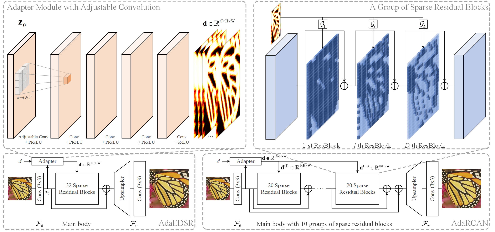
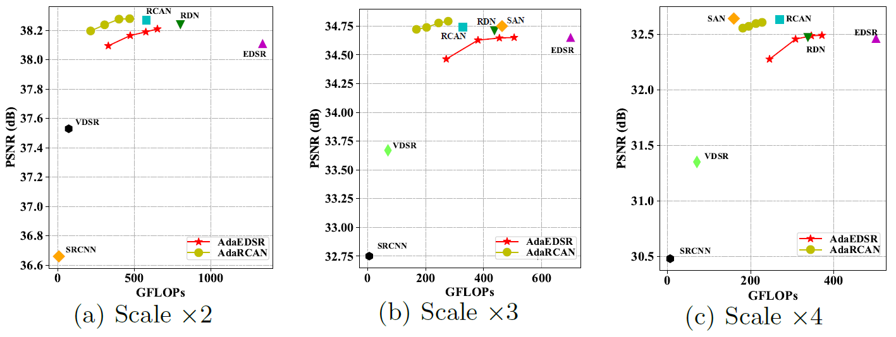
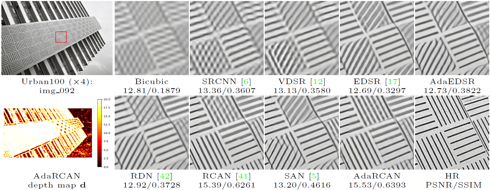

# AdaDSR

**PyTorch** implementation of [Deep Adaptive Inference Networks for Single Image Super-Resolution](https://arxiv.org/abs/2004.03915)

<p align="center"></p>
<p align="center">Overall structure of our AdaDSR.</p>

## Results

<p align="center"></p>
<p align="center">SISR results on Set5. More results please refer to the paper.</p>

<p align="center"></p>
<p align="center">An exemplar visualization of the SR results and depth map.</p>

## Preparation

- **Prerequisites**
    - PyTorch (v1.2)
    - Python 3.x, with OpenCV, Numpy, Pillow, tqdm and matplotlib, and tensorboardX is used for visualization
    - [optional] Make sure that matlab is in your PATH, if you want to calculate the PSNR/SSIM indices and use the argument `--matlab True`
    - [Sparse Conv] `cd masked_conv2d; python setup.py install`. Note that currently we provide a version modified from [open-mmlab/mmdetection](https://github.com/open-mmlab/mmdetection/tree/master/mmdet/ops/masked_conv), which supports inference with 3x3 sparse convolution layer. We will provide a more general version in the future.
- **Dataset**
    - Training
        - [DIV2K](https://data.vision.ee.ethz.ch/cvl/DIV2K/) is used for training, you can download the dataset from [ETH_CVL](https://data.vision.ee.ethz.ch/cvl/DIV2K/) or [SNU_CVLab](https://cv.snu.ac.kr/research/EDSR/DIV2K.tar).
        - The data should be organized as `DIV2K_ROOT/DIV2K_train_HR/*.png`, `DIV2K_ROOT/DIV2K_train_LR_bicubic/X[234]/*.png`, which is identical to the official format.
    - Testing
        - [Set5](http://people.rennes.inria.fr/Aline.Roumy/results/SR_BMVC12.html), [Set14](https://sites.google.com/site/romanzeyde/research-interests), [B100](https://www2.eecs.berkeley.edu/Research/Projects/CS/vision/bsds/), [Urban100](https://sites.google.com/site/jbhuang0604/publications/struct_sr) and [Manga109](http://www.manga109.org/en/index.html) are used for test.
        - You can download these datasets (~300MB) from [Google Drive](https://drive.google.com/open?id=1oacPCU5VPPy5swx8X8YU8ax7aVyCpPKJ) or [Baidu Yun](https://pan.baidu.com/s/1go1Y1reQUk68FX_n7ORMVQ) (43qz), and run `Prepare_TestData_HR_LR.m` in matlab, you can get two folders named `HR` and `LR`. Place these two folders in `BENCHMARK_ROOT`.
    - Models
        - Download the pre-trained models (~2.2GB) from [Google Drive](https://drive.google.com/open?id=1LmrkG5w0-JbP6t5413KOPpNlVG4hK3lZ) or [Baidu Yun](https://pan.baidu.com/s/1dcmO9Pc74Ta5p9liGwnDwA) (cyps), and put the two folders in the root folder.

## Quick Start

We show some exemplar commands here for better introduction, and more useful scripts are given in the [scripts](./scripts) folder.

### Testing

- AdaEDSR

    ```console
    python test.py --model adaedsr --name adaedsr_x2 --scale 2 --load_path ./ckpt/adaedsr_x2/AdaEDSR_model.pth --dataset_name set5 set14 b100 urban100 manga109 --depth 32 --chop True --sparse_conv True --matlab True --gpu_ids 0
    ```

- AdaRCAN
    
    ```console
    python test.py --model adarcan --name adarcan_x2 --scale 2 --load_path ./ckpt/adarcan_x2/AdaRCAN_model.pth --dataset_name set5 set14 b100 urban100 manga109 --depth 20 --chop True --sparse_conv True --matlab True --gpu_ids 0
    ```

### Training

- AdaEDSR (Load pre-trained EDSR model for more stable training)

    ```console
    python train.py --model adaedsr --name adaedsr_x2 --scale 2 --load_path ./pretrained/EDSR_official_32_x${scale}.pth
    ```

- AdaRCAN (Load pre-trained RCAN model for more stable training)

    ```console
    python train.py --model adarcan --name adarcan_x2 --scale 2 --load_path ./pretrained/RCAN_BIX2.pth
    ```

### Note

- You should set data root by `--dataroot DIV2K_ROOT` (train) or `--dataroot BENCHMARK_ROOT` (test), or you can add your own path in the rootlist of [div2k_dataset](./data/div2k_dataset.py#L11-L12) or [benchmark_dataset](./data/benchmark_dataset.py#L15-L16).
- You can specify which GPU to use by `--gpu_ids`, e.g., `--gpu_ids 0,1`, `--gpu_ids 3`, `--gpu_ids -1` (for CPU mode). In the default setting, all GPUs are used.
- You can refer to [options](./options/base_options.py) for more arguments.

## Citation
If you find AdaDSR useful in your research, please consider citing:

    @article{AdaDSR,
        title={Deep Adaptive Inference Networks for Single Image Super-Resolution},
        author={Liu, Ming and Zhang, Zhilu and Hou, Liya and Zuo, Wangmeng and Zhang, Lei},
        journal={arXiv preprint arXiv:2004.03915},
        year={2020}
    }

## Acknowledgement

This repo is built upon the framework of [CycleGAN](https://github.com/junyanz/pytorch-CycleGAN-and-pix2pix), and we borrow some code from [DPSR](https://github.com/cszn/DPSR), [mmdetection](https://github.com/open-mmlab/mmdetection), [EDSR](https://github.com/thstkdgus35/EDSR-PyTorch), [RCAN](https://github.com/yulunzhang/RCAN) and [SAN](https://github.com/daitao/SAN), thanks for their excellent work!